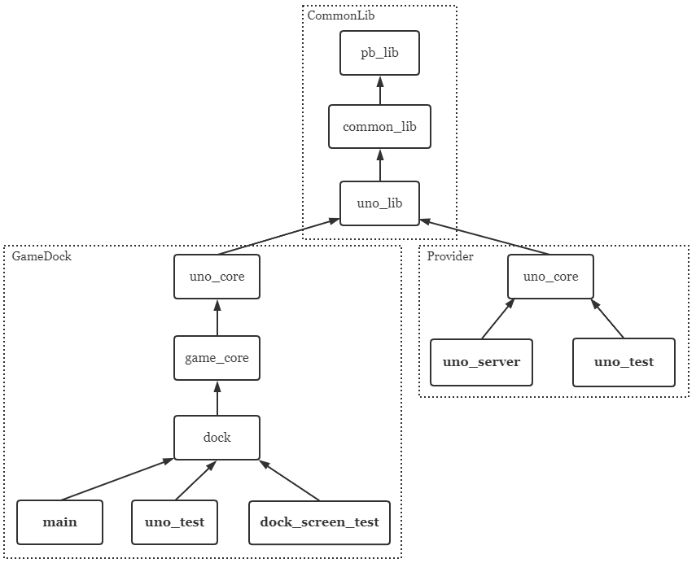

# CMake Target Dependency

Due to some reasons (e.g. avoid repetitive build), the number of SailGame's CMake targets is relatively large and dependency among them is kinda complex, so I feel it necessary to make a clarification.

In the above graph, each box represents a target, those with normal text is library while those with bold one is executable. The arrow means dependency added with `target_link_library`. E.g. `target_link_libraries(common_lib PUBLIC pb_lib)`, so common_lib box has an arrow pointing to pb_lib box.

Below is functionality and definition position of those libraries:

+ `pb_lib`, which is defined in `CommonLib/`, handles all dependencies related to grpc and protobuf;
+ `common_lib`, which is defined in `CommonLib/src/common`, provides some common utils like MsgBuilder;
+ `uno_lib`, which is defined in `CommonLib/src/uno`, provides some shared data type used by both side;
+ `uno_core`, which is defined in `Uno/src` in provider side and `GameDock/games/uno/core` in client side, provides implementations of state and state machine for uno game (and ui-related work in client side);
+ `game_core`, which is defined in `GameDock/games`, acts just like a proxy to provide a simple interface for dock;
+ `dock`, which is defined in `GameDock/dock`, includes some implementation related to ui (e.g. Lobby and Room);