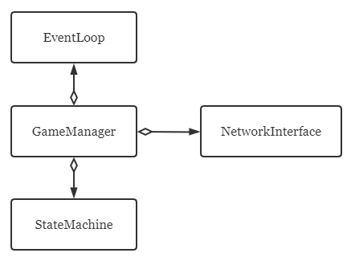

# CommonLib Walkthrough

## What is CommonLib

[CommonLib](https://github.com/SailGame/CommonLib) is a repository in SailGame, which acts as common library for provider and client written in cpp.

Here comes the anatomy of the repo: in the directory tree, there are

+ `cmake/`, which contains some util CMake files;
+ `include/sailgame/`, which contains header files that other project which integrate CommonLib as submodule could use;
+ `proto/`, [proto](https://github.com/SailGame/proto) submodule, with which CommonLib can manage dependencies related to protobuf for you;
+ `src/`, implementations of interfaces defined in `include/sailgame`.

## Why do you need CommonLib

+ CommonLib provides a framework for provider/client development, which implements some core components for event driven model (introduced below), and with that model, development of provider and client of non-ui part is as simple as implementing just state and state machine.

+ CommonLib provides some utility that may be used everywhere. 

  For example, with `CoreMsgBuilder` defined in CommonLib, you could write like

  ```c++
  LoginArgs args = CoreMsgBuilder::CreateLoginArgs("username", "password");
  ```

  instead of

  ```c++
  LoginArgs args;
  args.set_username("username");
  args.set_password("password");
  ```

+ CommonLib provides some data type that can be used by both provider and client side in order to reduce repetition.

  For example, `Card` type in Uno is defined in CommonLib so that it can be used by both sides. (You may wonder why not define such type in proto. Actually there is a `Card` in Uno proto. However we need more functionality on `Card` type than the generated one by protoc, e.g. `operator<` to sort handcards, so another `Card` type is defined).

+ CommonLib helps manage annoying dependencies of grpc and protobuf and provides a universal way to use them.

## How to integrate with CommonLib

That's quite easy. Just add CommonLib as subdirectory and put another `add_subdirectory` line in CMake file. (remember to remove proto submodule if you originally had one because proto affairs will be handled by CommonLib now)

Also, you can use some CMake options to customize your CommonLib:

+ By default CommonLib dismisses those game utils defined in it unless you turn on an option.

  For example, you want the CommonLib to build utils of Uno, you pass an option when using the lib:

  ```cmake
  set(BUILD_UNO_LIB ON)
  add_subdirectory(CommonLib)
  ```

+ By default CommonLib integrate with gRPC with pre-installed one. If you don't have gRPC in your machine and want to use submodule or CMake FetchContent, just turn on these options with some variables set:

  ```cmake
  # use submodule
  set(IMPORT_GRPC_BY_SUBMODULE ON)
  set(GRPC_SUBMODULE_DIR path/to/submodule)
  add_subdirectory(CommonLib)
  
  # use FetchContent
  set(IMPORT_GRPC_BY_FETCHCONTENT ON)
  set(GRPC_FETCHCONTENT_VERSION 1.32.0)
  add_subdirectory(CommonLib)
  ```

## Dive deeper

Essentially the so-called event driven model is implemented like below:



where NetworkInterface is responsible for receiving messages from core and wrap that as an event to push it to EventLoop. Meanwhile, EventLoop keeps checking whether there is any pending event to handle in the queue. Everytime an event gets processed, StateMachine's Transition method will be invoked and as user of CommonLib, it just needs to inherit a StateMachine which implements the Transition methods from the one in CommonLib and define state which is specific to the game.

Take [Uno Provider](https://github.com/SailGame/Uno) for an example.