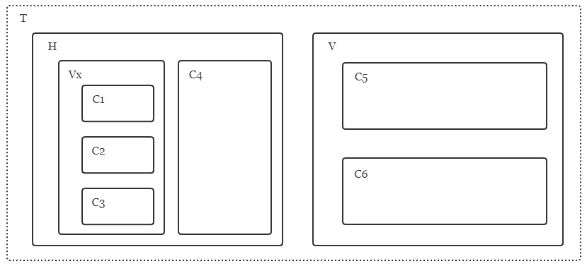

# Complete Guidance of New Game Development

Hi sailor, if you want to ship a game to the SailGame platform, you are now in the right place. This documentation will help to get started quickly.

## Preparation

Here is something you need to get familiar with before development:

+ The overall architecture of SailGame platform consists of three components: Core, Provider and Client. Briefly speaking, Core takes responsibility to connect Provider and Client. Core itself has no awareness about specific game logic. Instead it provides some common functionality like account, room and so on.

  As game developer, your work mainly focuses on Provider and Client. For each game, a pair of Provider and Client is required, where the former, which you can consider as backend or server, handles some state transition while the latter handles not just state transition but also user interaction.

  Take this [wiki](https://github.com/SailGame/Core/wiki/Cookbook-for-Provider-Dev) for a detailed illustration about relationship among the three components.

+ The communication of Client-Core and Core-Provider is implemented with gRPC. So theoretically we don't have too many restrictions on which language to use. However, at lease in present stage, cpp is recommended if you want an agile development process (because for now, there has already been Provider and Client developed with cpp which can be taken as a reference)

+ Currently each Provider occupies an individual repository, while all Clients share a single repo named [GameDock](https://github.com/SailGame/GameDock) (which is developed with cpp; another [GoDock](https://github.com/SailGame/GoDock) is also under development now). And [Core](https://github.com/SailGame/Core) holds an individual repo too. There could be much debate on this design. Anyway it works, and what happens happens. At least for now, it's completely ok.

## Development

Now it's time to get started. Let's take a real example, say you want to develop a game named *HearthScree*, which is a naive version of *HearthStone* because it doesn't support any keyword (e.g. Battlecry, Deathrattle and Taunt) on the card and it has no spell card either. That's to say, in *HearthScree*, there is only minion card with just attack point and health point. And also, hero has no skills or weapons.

### Define data format

Now think carefully. What should the data format be like in order to keep all Clients and Provider in consistency. Before designing the format, there is one thing to keep in mind: there are two state machines, each for Provider and Client side. They two both communicate with Core, and when receiving messages from Core, they make a transition to the state in state machine.

Here is my design of the proto data format for *HearthScree*:

(Note that `UserOperation` goes alone Client -> Core -> Provider while `NotifyMsg` does Provider -> Core -> Client)

```protobuf
message UserOperation {
    oneof Operation {
        Play play = 1;
        Attack attack = 2;
        EndTurn endTurn = 11;
    }
}

message NotifyMsg {
    oneof Msg {
        Play play = 1;
        Attack attack = 2;
        YourTurn yourTurn = 12;
        GameStart gameStart = 21;
    }
}

message GameStart {
    repeated Minion initHandcards = 1;
    // if true, you act first
    bool isOffensiveSide = 2;
}

message Play {
    Minion minion = 1;
}

message Attack {
    // the index of the attacker minion in battleground
    int32 attacker = 1;
    // the index of the attacked minion in battleground
    // if -1, it means the hero is attcked
    int32 attacked = 2;
}

message EndTurn {}

message YourTurn {
    Minion minion = 1;
}

message Minion {
    int32 attackPoint = 1;
    int32 healthPoint = 2;
}
```

hah, not too difficult, right? You may wonder where the hero health point goes or how to check if the game is over. Well in my design, these states are maintained by both sides of Provider and Client so the data format can be kept as simple as possible. Of course you can come up with other designs.

After designing the proto, you can raise a pr in [proto](https://github.com/SailGame/proto) repository.

### Provider startup

Now it's time to create a *HearthScree* repository as Provider, and we'd better import some useful dependencies. First add *[CommonLib](https://github.com/SailGame/CommonLib)* as submodule, which provides many useful functionalities (more stuff about *CommonLib* could be found [here](https://github.com/SailGame/SailGame/blob/main/docs/common-lib-walkthrough.md)). And then optionally googletest, spdlog or something else. It's recommended to put all your submodules under a single directory (like `lib/` or `externals/`).

Then it comes to part about specific game logic. Precisely speaking, we should now implementation state machine on both sides.

### Provider state machine implementation

Here comes the state machine of Provider side. Note that transition here produces `NotifyMsg` as side effects because when Provider receives a `UserOperation`, it needs to broadcast to all other players.

```c++
struct State {
    PlayerState players[2];
    int curPlayer;
}

struct PlayerState {
    int healthPoint;
    std::vector<Minion> deck;
}

ProviderMsgs StateMachine::Transition(const Play &msg) {
    // just forward the message to the other player
    return {msg};
}

ProviderMsgs StateMachine::Transition(const Attack &msg) {
    // update health point of player if attacked
    if (msg.attacked() == -1) {
        players[curPlayer].healthPoint -= msg.attacker().attackpoint();
    }
    return {msg};
}

ProviderMsgs StateMachine::Transition(const EndTurn &msg) {
    // toggle the current player
    curPlayer = 1 - curPlayer;
    YourTurn yourTurn;
    yourTurn.mutable_minion()->CopyFrom(players[curPlayer].deck.front());
    // tell the player what the minion he draws is
    return {yourTurn};
}
```

This is only some demo code, you can take [Uno Provider](https://github.com/SailGame/Uno) for detailed reference.

As for the Client side, principle is similar except it needs to maintain more states under my design.

### GameDock Introduction

In the GameDock repository, there are two main directories: `dock/` and `games/`. The former contains some logic about common ui of the platform like account, lobby and room, which is decoupled from specific game logic while the latter handles different games, which will be developed by you.

In the Client side, it needs to provide not only state machine but also ui. Now create a new directory named `hearth_scree/` under `games/` and here will store the two corresponding parts of code mainly: state machine on client side and ui (you could take `games/uno/` as an example, put code related to state machine under `games/hearth_scree/core` while ui code to `games/hearth_scree/ui`).

You could see from `games/uno/core` directory that most logic here is very similar to one in Provider side, which handles coming messages from Core and updates local state (except that state machine in Client side has no side effect to broadcast message back because it handles `UserOperation` elsewhere). However, there is a file named `game_attr.h` which is missing in Provider side. Generally speaking, each game needs to inherit a `GameAttr` from `Dock::IGameAttr` and implement some game-specific logic.

But why? That's due to the design of GameDock. As mentioned before, all game Clients share the same repository and there is a state machine for each game type (actually there is even a state machine for *non-game* type, i.e. player is now outside any game), so GameDock needs to switch among different state machines when game start and game over. And we add a layer called *UIProxy* to manage this switch.

For example, after login, UIProxy holds state machine of *non-game* type. When you join a room of Uno and start a new game, UIProxy will switch state machine to the one that Uno Client provides. After game is over, it will switch back. So how does dock know so many state machines of different games? The answer is the mechanism related to `GameAttr`.

### Work related to UI

Ok now here is just UI left. We choose [FTXUI](https://github.com/ArthurSonzogni/FTXUI) as our cpp ui library. It's a good choice to play with its [examples](https://github.com/ArthurSonzogni/FTXUI/tree/master/examples) in order to get familiar with it before developing ui.

The first thing you need to do is to inherit a `GameScreen` class from `Dock::GameScreen`. Remember the switch of state machine and `GameAttr` mechanism? yep, actually the components needed to switch include not only state machine, but also `GameScreen` because when playing different games, the main screen should also be different. And that both switches are accomplished by `GameAttr` mechanism.

Inside the game, the ui should be different with time passing. For example, in our *HearthScree*, when it's your turn you could see some interactive components like button to play a minion card to the battleground and order your minion to attack while in the opponent's round you could do nothing. Therefore, we need two screens for *YourTurn* and *NotYourTurn* which won't show at the same time.

With the help of FTXUI components, we can easily define a `TabContainer` to convey that semantic. Actually there are in total three kinds of containers in FTXUI: separately `TabContainer`, `HorizontalContainer` and `VerticalContainer`. Components in `TabContainer` won't show simultaneously while ones in `HorizontalContainer` or `VerticalContainer` could display in the screen at the same time, in a row or column. In terms of event, you could press *LeftArrow* and *RightArrow* to navigate inside `HorizontalContainer` (and of course *UpArrow* and *DownArrow* for `VerticalContainer`). However, for `TabContainer`, you need to define an external selector to determine which component inside the container should come up to show at current time. For example, choose `isYouTurn` in state machine as the external selector. If the variable is true, show *YourTurn* component and if false show *NotYourTurn*.

To be clearer, here comes a diagram:



In the most outside, there is a `TabContainer` *T*, which corresponds to `HearthScree::GameScreen` in our scenario. It has two components in the container, which are both container again: one is `HorizontalContainer` *H* and the other is `VerticalContainer` *V*. Note that we put *H* on the left while *V* on the right just for simplicity's sake, actually you cannot navigate between them with *LeftArrow* or *RightArrow* because they are children of `TabContainer`.

Inside *H*, there are two children: a `VerticalContainer` *Vx* which contains three normal components, and a normal component *C4*. In a similar way, *V* contains two children *C5* and *C6*, which are both normal components.

Say the focus is currently on component *C2*, now you can press *UpArrow* to move the focus to *C1* or *RightArrow* to *C4*. With FTXUI container mechanism, the ui event management will be relatively simple.

Cool, now you've known all the building blocks to develop a new game in SailGame platform. Just have a try.

